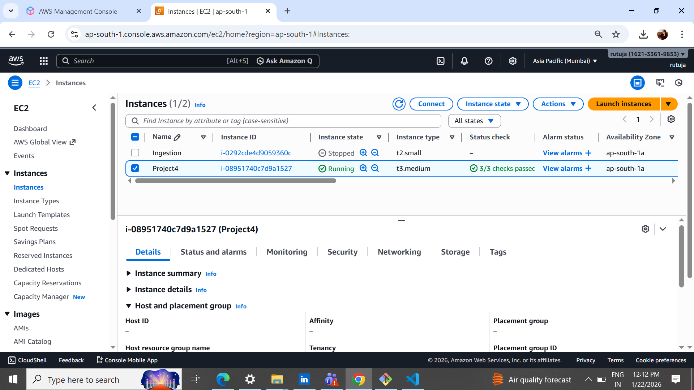
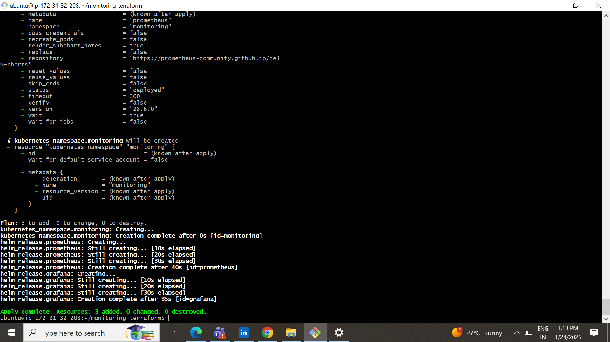

# Deploy Prometheus & Grafana on Kubernetes using Terraform + Helm

## Author: Rutuja Patil


This project guide is based on real-world errors and their fixes while
deploying Prometheus and Grafana on a Kubernetes cluster using Terraform
and Helm on AWS EC2 with Minikube.

------------------------------------------------------------------------

## 1. Prerequisites

-   AWS EC2 Ubuntu 22.04+
-   t3.medium
-   SSH Access
-   Internet Access
-   

-----------------------------------------------------------------------
AWS Security Group

Allow inbound:

-   22 (SSH)
-   3000 (Grafana)
-   9090 (Prometheus)

## 2. Install Docker

``` bash
sudo apt update -y
sudo apt install -y docker.io
sudo systemctl start docker
sudo systemctl enable docker
sudo usermod -aG docker $USER
newgrp docker
docker ps
```

------------------------------------------------------------------------

## 3. Install Minikube

``` bash
curl -LO https://storage.googleapis.com/minikube/releases/latest/minikube-linux-amd64
sudo install minikube-linux-amd64 /usr/local/bin/minikube
minikube start --driver=docker
kubectl get nodes
```

------------------------------------------------------------------------

## 4. Install kubectl

``` bash
curl -LO https://storage.googleapis.com/kubernetes-release/release/$(curl -s https://storage.googleapis.com/kubernetes-release/release/stable.txt)/bin/linux/amd64/kubectl
chmod +x kubectl
sudo mv kubectl /usr/local/bin/
```

------------------------------------------------------------------------

## 5. Install Helm

``` bash
curl https://raw.githubusercontent.com/helm/helm/main/scripts/get-helm-3 | bash
helm repo add prometheus-community https://prometheus-community.github.io/helm-charts
helm repo add grafana https://grafana.github.io/helm-charts
helm repo update
```

------------------------------------------------------------------------

## 6. Install Terraform

``` bash
wget https://releases.hashicorp.com/terraform/1.6.6/terraform_1.6.6_linux_amd64.zip
unzip terraform_1.6.6_linux_amd64.zip
sudo mv terraform /usr/local/bin/
terraform -v
```

------------------------------------------------------------------------

## 7. Project Structure

    prometheus-grafana-terraform/
    │
    ├── provider.tf
    ├── main.tf
    ├── versions.tf
    ├── outputs.tf

------------------------------------------------------------------------

## 8. Terraform Files

### versions.tf

``` hcl
terraform {
  required_providers {
    kubernetes = {
      source = "hashicorp/kubernetes"
    }
    helm = {
      source = "hashicorp/helm"
    }
  }
}
```

------------------------------------------------------------------------

### provider.tf

``` hcl
provider "kubernetes" {
  config_path = "/home/ubuntu/.kube/config"
}

provider "helm" {
  kubernetes {
    config_path = "/home/ubuntu/.kube/config"
  }
}
```

------------------------------------------------------------------------

### main.tf

``` hcl
resource "kubernetes_namespace" "monitoring" {
  metadata {
    name = "monitoring"
  }
}

resource "helm_release" "prometheus" {
  name       = "prometheus"
  repository = "https://prometheus-community.github.io/helm-charts"
  chart      = "prometheus"
  namespace  = kubernetes_namespace.monitoring.metadata[0].name
}

resource "helm_release" "grafana" {
  name       = "grafana"
  repository = "https://grafana.github.io/helm-charts"
  chart      = "grafana"
  namespace  = kubernetes_namespace.monitoring.metadata[0].name

  set {
    name  = "service.type"
    value = "NodePort"
  }
}
```

------------------------------------------------------------------------

### outputs.tf

``` hcl
output "grafana" {
  value = helm_release.grafana.name
}

output "prometheus" {
  value = helm_release.prometheus.name
}
```

------------------------------------------------------------------------

## 9. Deploy

``` bash
terraform init
terraform validate
terraform plan
terraform apply -auto-approve
```

------------------------------------------------------------------------

## 10. Verify

``` bash
kubectl get pods -n monitoring
kubectl get svc -n monitoring
```

------------------------------------------------------------------------

## 11. Browser Access Fix (Important)

### Grafana

``` bash
kubectl port-forward -n monitoring svc/grafana --address 0.0.0.0 3000:80
```

### Prometheus

``` bash
kubectl patch svc prometheus-server -n monitoring -p '{"spec": {"type": "NodePort"}}'
kubectl port-forward -n monitoring svc/prometheus-server --address 0.0.0.0 9090:80
```

------------------------------------------------------------------------

## 12. Open Browser

Grafana:

    http://<EC2-PUBLIC-IP>:3000

Prometheus:

    http://<EC2-PUBLIC-IP>:9090

------------------------------------------------------------------------


------------------------------------------------------------------------

## 14. Grafana Login

``` bash
kubectl get secret -n monitoring grafana -o jsonpath="{.data.admin-password}" | base64 --decode
```

Username: admin
Password: (output from above command)
------------------------------------------------------------------------

## 15. Add Prometheus in Grafana

URL:

    http://prometheus-server.monitoring.svc.cluster.local
    
🔗 Connect Prometheus to Grafana

Once Grafana opens:

⚙️ Settings → Data Sources

Add Prometheus

URL:

http://prometheus-server.monitoring.svc.cluster.local


Save & Test

📊 Import Dashboard

Click + → Import

ID: 3662

Select Prometheus

Import
------------------------------------------------------------------------


## 16. Destroy Everything

``` bash
terraform destroy -auto-approve
minikube delete
```

------------------------------------------------------------------------

## Problems Solved

✔ Docker permission denied\
✔ Kubernetes config path error\
✔ Terraform provider error\
✔ Minikube browser issue\
✔ NodePort & port-forward error

------------------------------------------------------------------------

## Author

**Rutuja Patil** DevOps \| AWS \| Kubernetes \| Terraform
